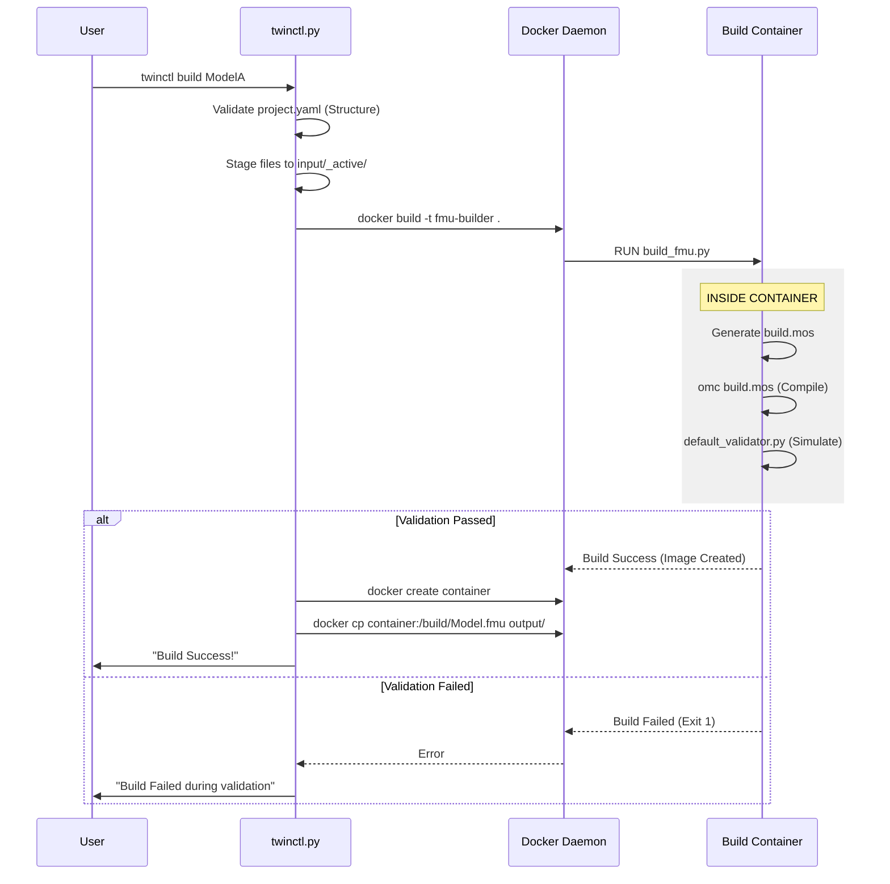

# FMU Build System - Technical Architecture

**Version:** 3.0 (Zero-Code Edition)
**Target Audience:** DevOps, System Architects, Advanced Users

---

## 1. System Overview

This system is a **Containerized FMU Factory**. It treats the FMU build process as a stateless transformation:
`Source Code + Config` -> `Docker Build` -> `Validation` -> `Verified FMU`

### core Philosophy
1.  **Immutability:** The build environment is locked in a Docker image.
2.  **Isolation:** Every build runs in a clean container. No dependency conflicts.
3.  **Fail-Fast:** Structural validation (CLI) happens before Functional validation (Docker).

---

## 2. Component Architecture

### 2.1 Control Plane (`twinctl.py`)
The CLI entry point. It runs on the **Host Machine**.
*   **Role:** Orchestrator.
*   **Key Responsibilities:**
    *   **Discovery:** Scans `input/models/` for valid projects.
    *   **Staging:** Copies model files to `input/_active/` (clean room).
    *   **Command Generation:** Constructs the `docker build` command.
    *   **Extraction:** Runs `docker create` + `docker cp` to retrieve the FMU.

### 2.2 Build Orchestrator (`build/build_fmu.py`)
This script runs **inside the Docker container** during the build.
*   **Role:** The "Brain" of the build.
*   **Key Responsibilities:**
    1.  **Parses `project.yaml`:** Reads model class, files, and validation settings.
    2.  **Generates `build.mos`:** Dynamically creates the OpenModelica script.
        *   Loads dependencies (`files.dependencies`).
        *   Loads main package (`files.main`).
        *   Commands `translateModelFMU()`.
    3.  **Executes Compilation:** Runs `omc build.mos`.
    4.  **Triggers Validation:** Calls `default_validator.py` if validation is active.

### 2.3 Verification Engine (`build/default_validator.py`)
This script also runs **inside the Docker container**, immediately AFTER compilation.
*   **Role:** Quality Gate.
*   **Key Responsibilities:**
    1.  **Loads FMU:** Uses `fmpy` to load the newly compiled FMU.
    2.  **Loads Data:** Reads `test_data/validation.csv`.
    3.  **Simulates:** Runs the FMU for the duration specified in CSV.
    4.  **Compares:** Checks `FMU Output` vs `CSV Expected Output`.
    5.  **Verdict:**
        *   **PASS:** Script exits with code 0. Docker build completes.
        *   **FAIL:** Script exits with code 1. Docker build ABORTS. Layer is not saved.

---

## 3. Data Flow



---

## 4. File System Layout

### 4.1 Host Machine
```
build_models/
├── input/
│   ├── models/MyModel/       # Source of Truth
│   └── _active/              # Ephemeral Staging (Deleted on clean)
├── output/                   # Artifacts
└── section 2.1               # CLI
```

### 4.2 Docker Container (`/build`)
```
/build/
├── input/src/                # Copied from host
├── build.mos                 # Generated script
├── DigitalTwin.fmu           # Compiled FMU
├── build_fmu.py
├── default_validator.py
└── project.yaml
```

---

## 5. Adding New Validators

The system uses `default_validator.py` by default. You can plug in custom logic.

1.  **Create Custom Script:** Add `my_custom_validator.py` to `build/`.
2.  **Update `project.yaml`:**
    ```yaml
    validation:
      custom: true
      script: "my_custom_validator.py"
    ```
3.  **Update `Dockerfile`:** Ensure script is copied to `/build`.

---

## 6. Docker Optimization

*   **Base Image:** `openmodelica/openmodelica:v1.25.1-minimal` (Configurable per model).
*   **Caching:** The `apt-get install` and `pip install` layers are cached. Re-builds only re-run the `COPY src/` and `RUN omc` steps.
*   **Multi-Stage:** Not currently used, but could be added to reduce image size (though we extract the FMU, so image size is less critical).
